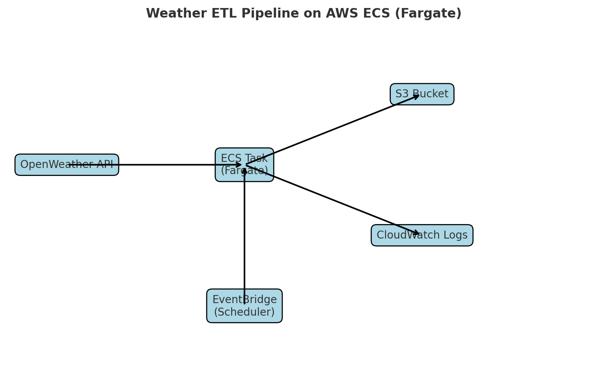

# ☁️ Weather ETL with AWS ECS (Fargate)
## 📌 Project Overview



This project implements a containerized ETL pipeline that:

Fetches weather and air quality data from the OpenWeather API

Saves data as JSON files

Uploads results to AWS S3

Runs as a Docker container deployed on AWS ECS (Fargate)

Is fully automated with EventBridge Scheduler and monitored in CloudWatch Logs


## ⚙️ Tech Stack

Python 3.11

Docker + AWS ECR (image build & registry)

ECS Fargate (serverless container runtime)

AWS S3 (data lake storage)

CloudWatch (logging & monitoring)

EventBridge (automation/scheduling)

## 📂 Project Structure

```
ecs-weather-etl/
├── scripts/            # ETL Python scripts
│   ├── main.py
|   ├── config.py
│   └── elt_jobs/
│       ├── weather_api.py
│       ├── load_to_s3.py
│       └── constants.py
├── Data/               # Output JSON data
├── plugins/            
├── logs/               # Local logs (optional, mounted in Docker)
├── Dockerfile
├── requirements.txt
└── README.md

```

## 🚀 Setup Instructions
1️⃣ Build and Tag Docker Image

```
docker build -t weather-elt:latest .
```

2️⃣ Push to AWS ECR

Create ECR

Note: Install AWS CLI and for Developement Purpose use Adminstrator Permission.

```
aws ecr create-repository --repository-name weather-etl --region ap-south-1
```

Authenticate and push the image:
```
aws ecr get-login-password --region ap-south-1 | `
  docker login --username AWS --password-stdin <account-id>.dkr.ecr.ap-south-1.amazonaws.com

docker tag weather-elt:latest <account-id>.dkr.ecr.ap-south-1.amazonaws.com/weather-elt:latest
docker push <account-id>.dkr.ecr.ap-south-1.amazonaws.com/weather-elt:latest

```

3️⃣ Create ECS Cluster and Task Definition

Launch type: Fargate

Task role: ecsTaskExecutionRole

Container image: Use the ECR image URI

Network: Default VPC, Public Subnet, Auto-assign Public IP

4️⃣ Run ECS Task

Runs the container once → fetches data from API → uploads JSON to S3

Logs stream to CloudWatch

5️⃣ Automate with EventBridge

Create EventBridge Rule with cron schedule

Example: cron(0 12 * * ? *) → runs daily at 12:00 (Indian Standard Time)


## 🔐 Environment Variables

Set in ECS Task Definition (or injected via AWS Secrets Manager):

```
API_KEY=<your_openweather_api_key>
AWS_ACCESS_KEY_ID=<your_aws_access_key>
AWS_SECRET_ACCESS_KEY=<your_aws_secret_key>
AWS_DEFAULT_REGION=ap-south-1
```

## 📊 Workflow

1. EventBridge triggers ECS task daily

2. ECS (Fargate) runs containerized ETL job

3. Data fetched from OpenWeather API

4. Results saved in S3 bucket

5. CloudWatch Logs capture task execution

## ✅ Current Status

✔️ ECS task runs successfully on Fargate
✔️ Logs available in CloudWatch
✔️ Files stored in S3
✔️ Automated scheduling with EventBridge