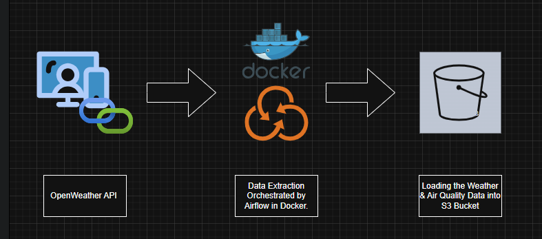
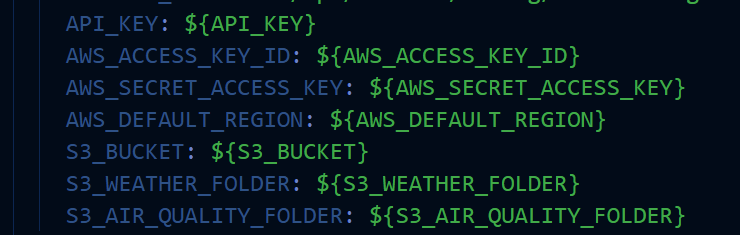
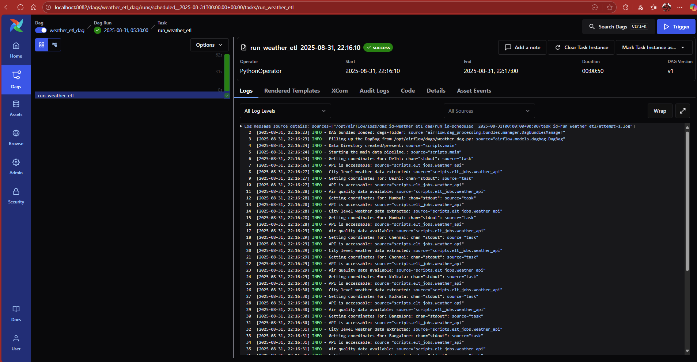

# ELT Using Airlfow-Docker.

Extraction of Weather and Air quality Data using Openweather API deployed using Airlfow and Docker. 

## 📌 Project Flow Diagram


## 📌 Project Overview
This project implements an **ELT pipeline** that:
- Fetches **weather** and **air quality** data from the OpenWeather API
- Stores raw JSON files in local storage
- Uploads processed data to **AWS S3**
- Orchestrates tasks using **Apache Airflow**
- Utilized Docker for Portability and Complete isolation from User operating system.

## ⚙️ Tech Stack
- **Apache Airflow** (Dockerized, CeleryExecutor)
- **Python 3.11**
- **AWS S3** (storage)
- **Postgres + Redis** (Airflow metadata & message broker)
- **Docker Compose**
- **DockerFile**

## 📂 Project Structure

```
weather_api_project/
├── dags/ # Airflow DAGs
│ └── weather_dag.py
├── scripts/ # ETL Python scripts
├── config/ # Configurations (airflow config)
├── plugins/ # Airflow plugins
├── logs/ # Airflow logs, project logs
├── Data/ # Raw JSON data
├── Dockerfile
├── docker-compose.yml
└── requirements.txt
```

## 🚀 Setup Instruction

- Clone the Repo & Navigate to the Project Folder.
- Start Airflow with Docker.
```bash
docker compose up -build
```
- Access Airflow UI. http://localhost:8082
- Username Username and Password Defined in .env
- Define the Openweather api, AWS Access key, Secret key, region and S3 Buckets in .env.
- Trigger DAG: weather_dag

## Environment Variables
```env
AIRFLOW_UID = 50000
_AIRFLOW_WWW_USER_USERNAME = <username>
_AIRFLOW_WWW_USER_PASSWORD = <password>
API_KEY=<your_openweather_api_key>
AWS_ACCESS_KEY_ID=<your_aws_access_key>
AWS_SECRET_ACCESS_KEY=<your_aws_secret_key>
AWS_DEFAULT_REGION=ap-south-1
S3_BUCKET=<s3_bucket_name>
S3_WEATHER_FOLDER=data/weather_data
S3_AIR_QUALITY_FOLDER=data/air_quality_data
```

## 📝 Note
- All the environmental variables mentioned above needs to be defined inside the docker-compose.yaml file environment section. Otherwise Docker-compose will looks only for Airflow environment variable defined inside.



## 🏃‍♂️ Docker & Airflow Run

```terminal
docker compose up -d
```

## Airflow Run



```terminal 
docker compose down -v
```

## Future Updates
- Moving the container into AWS ECS.
- Setting up Airflow Variables for S3 Details
- Setting up Credentials using AWS Secrets Manager
- Setting up Airlfow with RDS and Elasticache for DB and Cache.